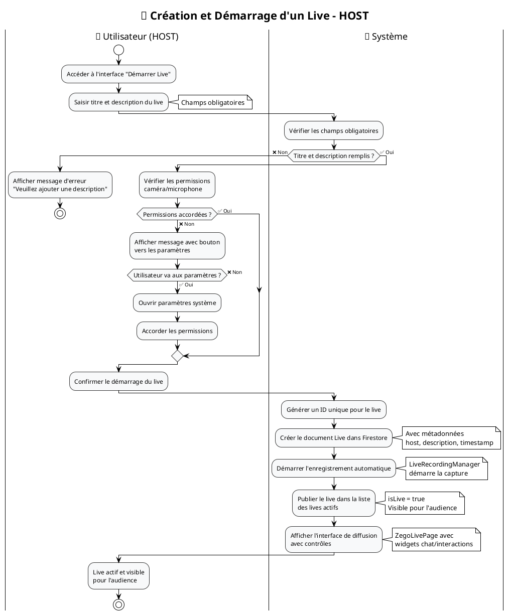

# 🔄 Diagrammes d'Activité - Application Streamyz

## 📋 Description
Ce document présente les diagrammes d'activité pour les deux cas d'utilisation principaux de l'application Streamyz.

---

## 🎥 Diagramme d'Activité : Création et Démarrage d'un Live

### 🎯 Code PlantUML



---

## 👥 Diagramme d'Activité : Rejoindre un Live

### 🎯 Code PlantUML

```plantuml
@startuml Rejoindre_Live

!theme plain
skinparam activityFontSize 12
skinparam activityArrowFontSize 10
skinparam partitionBorderColor #333333
skinparam activityBorderColor #333333
skinparam activityBackgroundColor #F0F8FF

title 👥 Rejoindre un Live - AUDIENCE

|👤 Utilisateur (AUDIENCE)|
start
:Parcourir la liste des lives actifs;

|📱 Système|
:Charger les lives disponibles\ndepuis Firestore;
note right: Filtrer par isLive = true

if (Lives disponibles ?) then (❌ Non)
  :Afficher "Aucun live en cours"\navec suggestion d'enregistrements;
  stop
else (✅ Oui)
  :Afficher la liste des lives actifs;
endif

|👤 Utilisateur (AUDIENCE)|
:Sélectionner un live à rejoindre;

|📱 Système|
:Vérifier la disponibilité du live;

if (Live encore actif ?) then (❌ Non)
  :Afficher "Ce live s'est terminé"\net proposer d'autres lives;
  |👤 Utilisateur (AUDIENCE)|
  stop
else (✅ Oui)
endif

:Charger l'interface de visionnage;
note right: ZegoLivePage en mode spectateur

:Établir la connexion au stream vidéo;
note right: ZegoCloud SDK\nconnexion WebRTC

if (Connexion réussie ?) then (❌ Non)
  :Afficher erreur de connexion;
  :Proposer de réessayer;
  stop
else (✅ Oui)
endif

:Mettre à jour le compteur\nde spectateurs (+1);
note right: Livestats.account\nincrémenté en temps réel

:Afficher le stream en direct;

fork
  :Afficher le chat en temps réel;
  note right: LiveChatWidget\nStream Firestore
fork again
  :Afficher les interactions\n(likes, roses);
  note right: LiveInteractionsWidget\nboutons d'engagement
fork again
  :Afficher les statistiques\ndu live;
  note right: LiveStatsWidget\nspectateurs, likes, cadeaux
end fork

|👤 Utilisateur (AUDIENCE)|
:Participer aux interactions\ndu live;

note bottom
**Interactions possibles :**
• Envoyer des messages dans le chat
• Envoyer des likes avec animations
• Envoyer des roses (cadeaux virtuels)
• Voir le profil du host
• Suivre/ne plus suivre le host
• Partager le live
• Signaler le live
end note

stop

@enduml
```

---

## 🔄 Diagramme d'Activité Combiné : Interaction HOST ↔ AUDIENCE

### 🎯 Code PlantUML

```plantuml
@startuml Interaction_Host_Audience

!theme plain
skinparam activityFontSize 11
skinparam activityArrowFontSize 9
skinparam partitionBorderColor #333333
skinparam activityBorderColor #333333

title 🔄 Interaction HOST ↔ AUDIENCE pendant un Live

|🎤 HOST|
start
:Live démarré et actif;

|👥 AUDIENCE|
:Rejoint le live;

|📱 Système|
:Mettre à jour le compteur\nde spectateurs;

|🎤 HOST|
:Voir nouvelle connexion\ndans les statistiques;

|👥 AUDIENCE|
:Envoyer message dans le chat;

|📱 Système|
:Diffuser le message\nà tous les participants;

|🎤 HOST|
:Lire le message de l'audience;
:Répondre dans le chat;

|📱 Système|
:Diffuser la réponse du HOST\navec badge spécial;

|👥 AUDIENCE|
:Voir la réponse du HOST;
:Envoyer des likes/roses;

|📱 Système|
:Mettre à jour les statistiques\nen temps réel;
:Afficher les animations;

|🎤 HOST|
:Voir l'augmentation\ndes likes/cadeaux;

fork
  |🎤 HOST|
  :Contrôler micro/caméra\nselon les interactions;
fork again
  |👥 AUDIENCE|
  :Continuer les interactions\n(chat, likes, partage);
fork again
  |📱 Système|
  :Maintenir l'enregistrement\net les statistiques;
end fork

note across
**Cycle d'interaction continu jusqu'à la fin du live**
• Communication bidirectionnelle via chat
• Feedback temps réel via likes/cadeaux
• Statistiques mises à jour en continu
• Enregistrement automatique de toute la session
end note

|🎤 HOST|
:Décider d'arrêter le live;
:Confirmer l'arrêt;

|📱 Système|
:Finaliser l'enregistrement;
:Mettre isLive = false;
:Notifier la fin aux spectateurs;

|👥 AUDIENCE|
:Recevoir notification\nde fin de live;

stop

@enduml
```

---

## 📊 Analyse des Diagrammes d'Activité

### **🎥 Création et Démarrage d'un Live**

| **Phase** | **Acteur Principal** | **Actions Clés** | **Points de Contrôle** |
|-----------|---------------------|------------------|------------------------|
| **Initialisation** | HOST | Accès interface, saisie données | Validation champs obligatoires |
| **Vérifications** | Système | Contrôle permissions | Caméra/micro autorisés |
| **Création** | Système | Génération ID, création document | Base de données cohérente |
| **Activation** | Système | Enregistrement, publication | Live visible et fonctionnel |

### **👥 Rejoindre un Live**

| **Phase** | **Acteur Principal** | **Actions Clés** | **Points de Contrôle** |
|-----------|---------------------|------------------|------------------------|
| **Découverte** | AUDIENCE | Navigation, sélection | Lives disponibles |
| **Connexion** | Système | Vérification, établissement connexion | Live actif, connexion réussie |
| **Intégration** | Système | Mise à jour compteurs, interfaces | Spectateur ajouté |
| **Participation** | AUDIENCE | Interactions multiples | Engagement actif |

### **🔄 Points d'Interaction Critiques**

#### **🔗 Synchronisation Temps Réel**
- **Chat** : Messages diffusés instantanément à tous les participants
- **Statistiques** : Compteurs mis à jour en continu (spectateurs, likes, cadeaux)
- **Notifications** : Alertes en temps réel pour nouvelles connexions/actions

#### **⚡ Gestion des Erreurs**
- **Permissions** : Redirection vers paramètres système
- **Connexion** : Gestion des échecs de connexion WebRTC
- **Disponibilité** : Vérification continue de l'état des lives

#### **📈 Métriques et Suivi**
- **Engagement** : Tracking des interactions (messages, likes, cadeaux)
- **Qualité** : Monitoring de la connexion et performance
- **Enregistrement** : Capture automatique pour replay

---

## 🛠️ Instructions d'Utilisation

### **Pour PlantUML :**
1. Copier l'un des codes PlantUML ci-dessus
2. Le coller dans [plantuml.com](http://plantuml.com/plantuml)
3. Ou utiliser l'extension PlantUML dans VS Code
4. Le diagramme sera généré automatiquement

### **Pour l'Analyse :**
- **Compréhension des flux** : Suivre les chemins principaux et alternatifs
- **Identification des risques** : Points de défaillance potentiels
- **Optimisation** : Amélioration des parcours utilisateur
- **Tests** : Validation de tous les scénarios possibles

Ces diagrammes d'activité constituent une **documentation comportementale complète** des cas d'utilisation principaux de Streamyz ! 