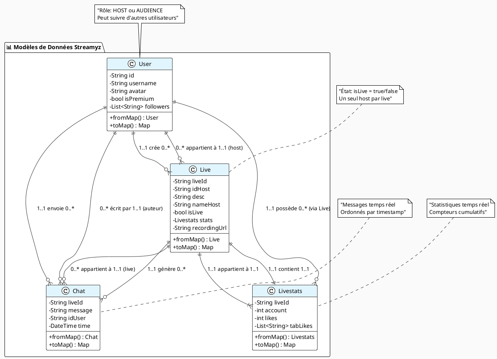

# 🏗️ Diagramme de Classes - Application Streamyz (Version Simplifiée)

## 📋 Description
Ce diagramme présente les **4 modèles de données essentiels** de l'application Streamyz avec leurs relations métier.

---

## 🎯 Code PlantUML (Version Simplifiée)

---

## 🎯 **Les 4 Modèles de Données Essentiels**

### **📱 Modèles de Données Streamyz**

| **Classe** | **Rôle** | **Attributs Clés** | **Importance** |
|------------|----------|-------------------|----------------|
| **User** | Gestion des utilisateurs, profils, followers | `id`, `username`, `avatar`, `isPremium`, `followers` | **CRITIQUE** - Base de tous les utilisateurs |
| **Live** | Représentation des lives avec métadonnées | `liveId`, `idHost`, `desc`, `isLive`, `stats`, `recordingUrl` | **CRITIQUE** - Cœur de l'application |
| **Chat** | Messages en temps réel pendant les lives | `liveId`, `message`, `idUser`, `time` | **ESSENTIEL** - Communication principale |
| **Livestats** | Statistiques (spectateurs, likes, cadeaux) | `liveId`, `account`, `likes`, `tabLikes` | **ESSENTIEL** - Engagement utilisateur |

---

## 🔗 **Relations et Cardinalités Détaillées**

### **📊 Relations entre Modèles de Données**

| **Relation** | **Type** | **Cardinalité** | **Description** |
|--------------|----------|-----------------|-----------------|
| `Live` ↔ `Livestats` | **Composition** | `1..1 ↔ 1..1` | Chaque live a exactement une instance de statistiques |
| `Live` ↔ `Chat` | **Agrégation** | `1..1 ↔ 0..*` | Un live peut avoir zéro ou plusieurs messages |
| `User` ↔ `Live` | **Association** | `1..1 ↔ 0..*` | Un utilisateur peut créer zéro ou plusieurs lives |
| `User` ↔ `Chat` | **Association** | `1..1 ↔ 0..*` | Un utilisateur peut envoyer zéro ou plusieurs messages |
| `User` ↔ `Livestats` | **Association indirecte** | `1..1 ↔ 0..*` | Via les lives créés par l'utilisateur |

### **🔄 Relations Indirectes et Héritées**

| **Relation** | **Type** | **Cardinalité** | **Description** |
|--------------|----------|-----------------|-----------------|
| `User` ↔ `Livestats` | **Association indirecte** | `1..1 ↔ 0..*` | Via les lives créés par l'utilisateur |
| `Live` ↔ `User` (host) | **Association directe** | `0..* ↔ 1..1` | Chaque live a un host unique |
| `Chat` ↔ `User` (auteur) | **Association directe** | `0..* ↔ 1..1` | Chaque message a un auteur unique |
| `Chat` ↔ `Live` (appartenance) | **Association directe** | `0..* ↔ 1..1` | Chaque message appartient à un live |
| `Livestats` ↔ `Live` (composition) | **Composition forte** | `1..1 ↔ 1..1` | Cycle de vie lié |

---

## 📋 **Légende des Cardinalités et Relations**

### **🔢 Notation des Multiplicités**

| **Notation** | **Signification** | **Exemple** |
|--------------|-------------------|-------------|
| `1..1` | **Exactement un** | Un live a exactement une statistique |
| `0..1` | **Zéro ou un** | Un utilisateur peut avoir un profil premium |
| `0..*` | **Zéro ou plusieurs** | Un utilisateur peut créer plusieurs lives |
| `1..*` | **Un ou plusieurs** | Un live doit avoir au moins un participant |

### **🔗 Types de Relations UML**

| **Symbole** | **Type** | **Signification** | **Usage** |
|-------------|----------|-------------------|-----------|
| `\|\|--\|\|` | **Composition** | Relation forte, cycle de vie lié | `Live` contient `Livestats` |
| `\|\|--o{` | **Agrégation** | Relation faible, existence indépendante | `Live` agrège `Chat` |
| `..>` | **Dépendance** | Utilisation temporaire | `Service` utilise `Model` |
| `*--` | **Composition forte** | Destruction en cascade | `Page` compose `Widget` |
| `o--` | **Agrégation faible** | Référence sans propriété | `User` référence `Live` |

### **📋 Stéréotypes et Contraintes**

| **Stéréotype** | **Signification** | **Exemple** |
|----------------|-------------------|-------------|
| `<<utilise>>` | Service utilise un modèle | `FirestoreHelper` utilise `User` |
| `<<crée>>` | Service crée une instance | `LiveRecordingManager` crée `Recording` |
| `<<modifie>>` | Composant modifie des données | `InteractionsWidget` modifie `Livestats` |
| `<<autorise>>` | Service donne accès | `PermissionManager` autorise `Camera` |

---

## 🎯 **Contraintes Métier**

### **👤 Contraintes Utilisateur**
- Un `User` ne peut être que **HOST** ou **AUDIENCE** pour un live donné
- Un `User` peut suivre plusieurs autres utilisateurs (`0..*`)
- Un `User` premium a accès à des fonctionnalités supplémentaires

### **📺 Contraintes Live**
- Un `Live` a un seul `User` comme host (`1..1`)
- Un `Live` peut avoir plusieurs spectateurs (`0..*`)
- Un `Live` doit avoir un `Livestats` valide (`1..1`)
- L'état `isLive` détermine si le live est actif

### **💬 Contraintes Chat**
- Un `Chat` appartient à un seul `Live` (`1..1`)
- Un `Chat` est écrit par un seul `User` (`1..1`)
- Les messages sont ordonnés par timestamp

### **📊 Contraintes Statistiques**
- `Livestats` est mis à jour en temps réel
- Le compteur `account` représente le nombre de spectateurs actuels
- Le compteur `likes` est cumulatif et croissant

---

## 🎯 **Pourquoi Ces 4 Modèles de Données ?**

### **🚀 Classes Critiques (Fondamentales)**
1. **User** - **BASE** : Sans utilisateurs, pas d'application possible
2. **Live** - **CŒUR** : Entité centrale de l'application de streaming

### **⚡ Classes Essentielles (Fonctionnalités clés)**
3. **Chat** - **COMMUNICATION** : Interaction temps réel entre users
4. **Livestats** - **ENGAGEMENT** : Mesure et suivi de l'activité

### **🔗 Interdépendances des Modèles**
- `User` **crée** `Live` → Pas de live sans créateur
- `Live` **contient** `Livestats` → Chaque live a ses statistiques
- `Live` **génère** `Chat` → Communication liée au contexte du live
- Tous les modèles sont **interconnectés** et forment un écosystème cohérent

---

## 🛠️ **Instructions d'Utilisation**

### **Pour PlantUML :**
1. Copier le code PlantUML simplifié ci-dessus
2. Le coller dans [plantuml.com](http://plantuml.com/plantuml)
3. Ou utiliser l'extension PlantUML dans VS Code

### **Architecture Focalisée sur les Données :**
- **Modèles purs** : Seulement les entités métier essentielles
- **Relations directes** : Liens entre données uniquement
- **Compréhension métier** : Focus sur la logique applicative
- **Base solide** : Fondations pour les développements futurs

Cette version **centrée sur les données** permet de **comprendre le cœur métier** de Streamyz sans la complexité technique des services et interfaces ! 