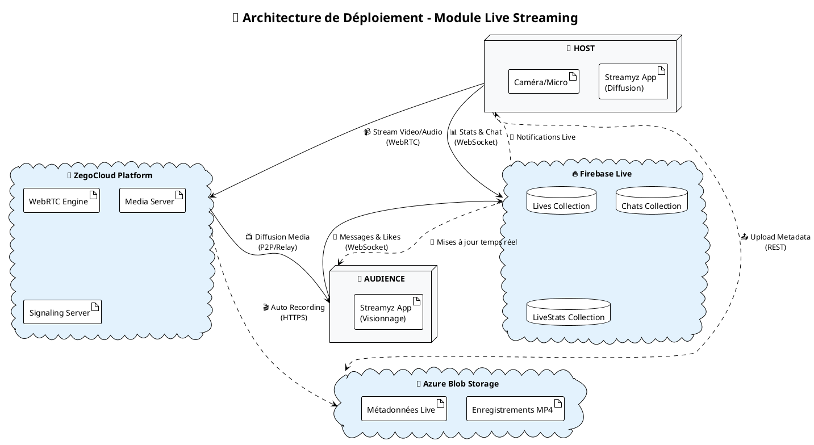

# 🎥 Diagramme de Déploiement - Module Live Streaming

## 📋 Description
Ce diagramme présente l'architecture de déploiement du **module live streaming** de Streamyz, incluant les composants spécifiques à la diffusion en direct et aux interactions temps réel.

---

## 🏗️ Code PlantUML - Module Live Streaming

---

## 🏗️ Architecture du Module Live Streaming

### **👤 Acteurs Principaux**
- **HOST** : Diffuse le live via caméra/microphone
- **AUDIENCE** : Visionne le live et interagit (chat, likes)

### **🎥 Composants Spécialisés**

| **Composant** | **Fonction Live Streaming** | **Technologie** |
|---------------|----------------------------|-----------------|
| **📡 ZegoCloud Platform** | Diffusion vidéo/audio temps réel | WebRTC P2P + Media Server |
| **🔥 Firebase Live** | Données temps réel (Chat, Stats, Lives) | Firestore + WebSocket |
| **💾 Azure Blob Storage** | Enregistrements automatiques MP4 | Blob Storage + Metadata |

### **🎬 Fonctionnalités Spécifiques**
- **Streaming bidirectionnel** : HOST diffuse, AUDIENCE reçoit
- **Chat temps réel** : Messages instantanés pendant le live
- **Statistiques live** : Compteurs spectateurs, likes, cadeaux
- **Enregistrement automatique** : Sauvegarde MP4 en arrière-plan

---

## 🔗 Flux de Communication Live

### **📹 Flux Streaming Principal**
1. **HOST → ZegoCloud** : Envoi vidéo/audio via WebRTC
2. **ZegoCloud → AUDIENCE** : Diffusion media (P2P ou relay)
3. **Bidirectionnel** : Signaling et négociation WebRTC

### **💬 Flux Données Temps Réel**
1. **HOST ↔ Firebase** : Stats live, gestion du live, réception chat
2. **AUDIENCE ↔ Firebase** : Envoi messages/likes, réception stats
3. **Synchronisation** : Notifications et mises à jour instantanées

### **🎬 Flux Enregistrement**
1. **ZegoCloud → Azure** : Enregistrement automatique MP4
2. **HOST → Azure** : Upload métadonnées et miniatures
3. **Stockage persistant** : Sauvegarde pour visionnage ultérieur

### **🔒 Sécurité Live Streaming**
- **WebRTC sécurisé** : DTLS pour l'audio/vidéo
- **Firebase Auth** : Authentification des participants
- **Tokens temporaires** : Accès limité dans le temps aux ressources

---

## 🛠️ Instructions d'Utilisation

### **Pour PlantUML :**
1. Copier le code PlantUML ci-dessus
2. Le coller dans [plantuml.com](http://plantuml.com/plantuml)
3. Ou utiliser l'extension PlantUML dans VS Code

### **Avantages du Diagramme Live Streaming :**
- **Focus spécialisé** : Architecture dédiée au streaming temps réel
- **Flux identifiés** : Séparation claire entre streaming, chat et enregistrement
- **Acteurs distincts** : HOST et AUDIENCE avec leurs rôles spécifiques
- **Technologies précises** : WebRTC, WebSocket, Blob Storage pour chaque usage

Ce diagramme de déploiement offre une **vision spécialisée** du module live streaming de Streamyz ! 