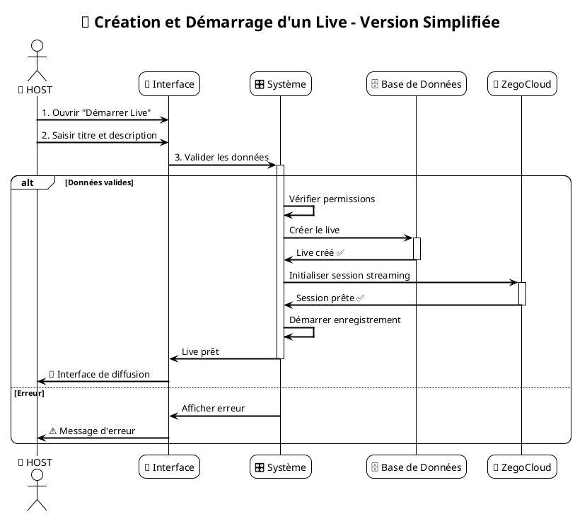
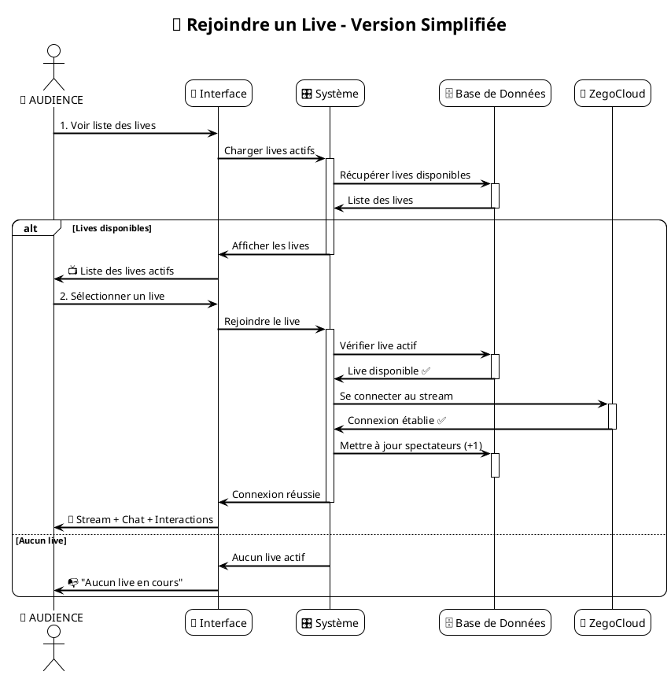

# 🔄 Diagrammes de Séquence - Application Streamyz

## 📋 Description
Ce document présente les diagrammes de séquence **simplifiés** pour les cas d'utilisation "Création et démarrage d'un live" et "Rejoindre un live" avec leurs flux principaux.

---

## 🎥 Diagramme de Séquence : Création et Démarrage d'un Live

### 🎯 Flux Principal Simplifié

---

## 👥 Diagramme de Séquence : Rejoindre un Live

### 🎯 Flux Principal Simplifié

---

## 📊 Analyse des Diagrammes de Séquence Simplifiés

### **🎥 Création et Démarrage d'un Live**

| **Élément** | **Description** | **Rôle** |
|-------------|-----------------|----------|
| **Participants** | HOST, Interface, Système, Base de Données, ZegoCloud | 5 acteurs principaux |
| **Flux principal** | Saisie → Validation → Création → Streaming → Activation | Processus avec streaming |
| **Gestion d'erreur** | Alternative intégrée avec `alt/else` | Gestion directe des échecs |
| **Points critiques** | Validation données, Permissions, Session ZegoCloud | 3 points de contrôle |

### **👥 Rejoindre un Live**

| **Élément** | **Description** | **Rôle** |
|-------------|-----------------|----------|
| **Participants** | AUDIENCE, Interface, Système, Base de Données, ZegoCloud | 5 acteurs principaux |
| **Flux principal** | Navigation → Sélection → Connexion ZegoCloud → Affichage | Processus avec streaming |
| **Gestion d'erreur** | Alternative pour absence de live | Cas d'échec principal |
| **Points critiques** | Disponibilité lives, Connexion ZegoCloud, Mise à jour stats | 3 points de contrôle |

---

## 🔗 Interactions Système Simplifiées

### **📡 Composants Principaux**
- **Interface** : Interaction avec l'utilisateur
- **Système** : Logique métier et contrôles
- **Base de Données** : Stockage et récupération des données
- **ZegoCloud** : Service de streaming temps réel WebRTC

### **🔄 Flux Simplifiés**
- **Création Live** : HOST → Interface → Système → Base de données → ZegoCloud
- **Rejoindre Live** : AUDIENCE → Interface → Système → Base de données → ZegoCloud

### **⚡ Points de Contrôle**
- **Validation des données** (titre, description)
- **Vérification des permissions** (caméra, micro)
- **Contrôle de disponibilité** des lives
- **Connexion streaming** ZegoCloud (WebRTC)

---

## 🛠️ Instructions d'Utilisation

### **Pour PlantUML :**
1. Copier l'un des codes PlantUML ci-dessus
2. Le coller dans [plantuml.com](http://plantuml.com/plantuml)
3. Ou utiliser l'extension PlantUML dans VS Code

### **Avantages de la Version Simplifiée :**
- **Lisibilité maximale** : Diagrammes épurés et faciles à comprendre
- **Focus sur l'essentiel** : Flux principaux sans complexité inutile
- **Compréhension rapide** : Vision claire des interactions principales
- **Maintenance facilitée** : Documentation concise et à jour

Ces diagrammes de séquence simplifiés offrent une **vision claire et directe** des fonctionnalités principales de Streamyz ! 