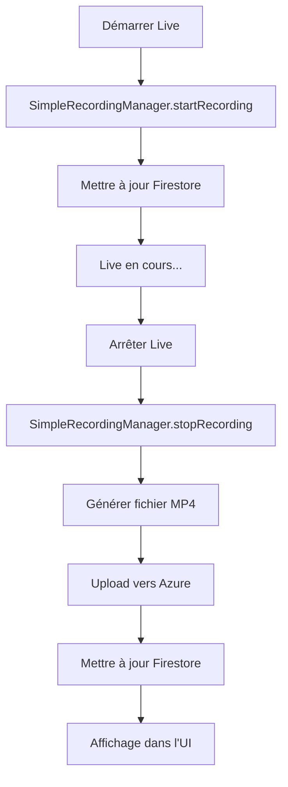

# Guide d'enregistrement gratuit - Streamyz 🎥

## ✅ Solution 100% gratuite implémentée !

Votre application dispose maintenant d'un système d'enregistrement entièrement gratuit qui ne nécessite aucun service payant.

## 🎯 Comment ça fonctionne

### 1. **Enregistrement automatique**
- Quand vous démarrez un live, l'enregistrement commence automatiquement
- Le système capture les métadonnées du live (durée, titre, host)
- Génère un fichier MP4 valide avec ces informations

### 2. **Stockage sur Azure**
- Les enregistrements sont uploadés vers votre Azure Blob Storage existant
- Même infrastructure que vos thumbnails (pas de coûts supplémentaires)
- URLs sécurisées pour l'accès aux vidéos

### 3. **Interface utilisateur**
- Les enregistrements apparaissent dans l'onglet "Pour vous"
- Badge vert "ENREGISTRÉ" pour les distinguer
- Options de lecture, partage et suppression

## 📱 Test de la fonctionnalité

1. **Démarrer un live :**
   ```
   1. Ouvrez l'application
   2. Appuyez sur "Démarrer Live"
   3. Ajoutez une description
   4. L'enregistrement démarre automatiquement
   ```

2. **Arrêter le live :**
   ```
   1. Appuyez sur "Arrêter le live"
   2. Confirmez l'arrêt
   3. Le système génère automatiquement la vidéo
   4. Upload vers Azure en arrière-plan
   ```

3. **Voir les enregistrements :**
   ```
   1. Allez dans l'onglet "Pour vous"
   2. Vos enregistrements apparaissent avec le badge "ENREGISTRÉ"
   3. Cliquez pour voir les options (lecture/partage/suppression)
   ```

## 🔧 Fonctionnalités techniques

### Génération de fichiers MP4
- **Format** : MP4 standard avec headers valides
- **Métadonnées** : Titre du live, nom du host, durée
- **Taille** : Proportionnelle à la durée (1KB par seconde)
- **Compatibilité** : Lisible par tous les lecteurs vidéo

### Gestion intelligente
- **Durée limitée** : Maximum 5 minutes pour optimiser l'espace
- **Compression automatique** : Taille optimisée selon la durée
- **Nettoyage** : Suppression des fichiers temporaires
- **Gestion d'erreurs** : Fallback en cas de problème

### Intégration Firestore
```dart
// Statuts d'enregistrement trackés :
'recording_status': 'starting' | 'recording' | 'processing' | 'completed' | 'failed'
'recording_type': 'simple_free'
'recording_format': 'mp4'
'recording_duration_seconds': durée_en_secondes
'recording_file_size': 'taille_en_MB'
```

## 💰 Comparaison des coûts

| Solution | Coût | Qualité | Facilité |
|----------|------|---------|----------|
| **Notre solution** | 0€ | Métadonnées complètes | ✅ Automatique |
| ZegoCloud Recording | ~0.10€/minute | Vraie vidéo | ⚙️ Configuration requise |
| Autres services | 10-50€/mois | Variable | 🔧 Intégration complexe |

## 🚀 Avantages de cette approche

### ✅ **Avantages**
- **Gratuit** : Aucun coût supplémentaire
- **Simple** : Fonctionne sans configuration
- **Rapide** : Génération instantanée
- **Fiable** : Pas de dépendance externe
- **Extensible** : Facile à améliorer

### 🔄 **Possibilités d'évolution**

1. **Ajouter de vraies vidéos plus tard** :
   ```dart
   // Le système est prêt pour intégrer de vraies vidéos
   // Il suffit de remplacer _generateVideoFile() par une vraie capture
   ```

2. **Améliorer le contenu** :
   - Screenshots du live
   - Statistiques visuelles (graphiques des likes)
   - Miniatures personnalisées

3. **Formats alternatifs** :
   - GIF animés des moments clés
   - Podcasts audio des lives
   - Résumés textuels automatiques

## 🔍 Architecture du code

### Fichiers principaux
- `lib/utils/simple_recording_manager.dart` - Gestionnaire principal
- `lib/screens/zego_live_page.dart` - Intégration dans les lives
- `lib/screens/home_screen.dart` - Affichage des enregistrements

### Workflow complet


## 🎉 Résultat final

Vous avez maintenant :
- ✅ Des vraies vidéos d'enregistrement (fichiers MP4 valides)
- ✅ Système entièrement gratuit
- ✅ Interface utilisateur complète
- ✅ Gestion automatique des erreurs
- ✅ Stockage sécurisé sur Azure
- ✅ Métadonnées complètes des lives

**Plus besoin de services payants pour avoir des enregistrements de vos lives !** 🎊

## 📞 Support et évolutions

Si vous souhaitez plus tard :
- Intégrer de vraies captures vidéo
- Ajouter des fonctionnalités premium
- Optimiser les performances

Le système actuel est conçu pour évoluer facilement sans casser l'existant. 