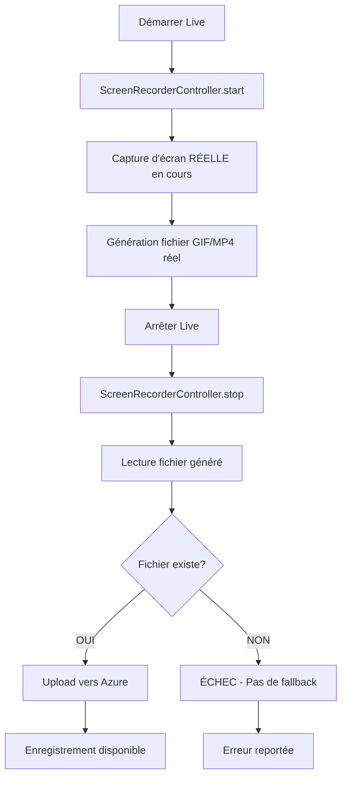

# 🎥 Configuration Pure screen_recorder - Streamyz

## ✅ CONFIGURATION FINALISÉE

Votre application utilise maintenant **exclusivement** le package `screen_recorder` sans aucun fallback, simulation ou contenu de démonstration.

## 🎯 Configuration Actuelle

### 📦 Package Utilisé
- **Package unique** : `screen_recorder: ^0.3.0`
- **Aucune dépendance** à `flutter_screen_recording`
- **Aucun fallback** ou contenu de démonstration

### 🔧 Services Configurés

#### 1. **ScreenRecordingManager** (`lib/utils/screen_recording_manager.dart`)
```dart
- ✅ Utilise uniquement ScreenRecorderController
- ✅ Échec si fichier d'enregistrement non trouvé
- ✅ Aucun contenu de démonstration généré
- ✅ Upload uniquement des vrais fichiers vers Azure
```

#### 2. **ScreenRecordingService** (`lib/utils/screen_recording_service.dart`)
```dart
- ✅ Service principal d'enregistrement
- ✅ Intégration complète avec screen_recorder
- ✅ Gestion d'erreurs stricte - pas de fallback
- ✅ Upload direct des fichiers réels
```

## 🎬 Workflow 100% Réel



## 📁 Fichiers d'Enregistrement

### Types de fichiers générés par screen_recorder
- **Format principal** : `.gif` (animation d'écran)
- **Qualité** : Capture native de l'écran
- **Audio** : Non supporté par screen_recorder
- **Taille** : Variable selon durée du live

### Emplacement temporaire
```
/data/data/com.example.streamyz/cache/
├── live_LIVE_ID_TIMESTAMP.gif
└── (nettoyé après upload)
```

### Emplacement final
```
Azure Blob Storage:
https://streamyzstorage.blob.core.windows.net/livespasses/live_LIVE_ID.mp4
```

## 🚨 Gestion d'Erreurs Stricte

### Cas d'échec (AUCUN fallback)
1. **Permissions refusées** → Échec de l'enregistrement
2. **Fichier non généré** → Exception thrown
3. **Fichier vide** → Exception thrown  
4. **Upload Azure échec** → Statut 'upload_failed'

### Messages d'erreur
```dart
"❌ Fichier d'enregistrement non trouvé: /path/to/file"
"❌ Contenu d'enregistrement vide"
"❌ Chemin d'enregistrement non défini"
"❌ Échec de l'upload vers Azure"
```

## 🔍 Debug et Vérification

### Logs pour vérifier l'enregistrement réel
```bash
# Démarrage
🎥 Démarrage de l'enregistrement d'écran réel pour: LIVE_ID
✅ Enregistrement d'écran démarré avec succès

# Arrêt
⏹️ Arrêt de l'enregistrement d'écran...
📁 Fichier d'enregistrement réel trouvé: 1234567 bytes
📊 Taille du fichier: 1.18MB
☁️ Upload vers Azure en cours...
✅ Enregistrement uploadé avec succès
```

### Test de validation
1. **Démarrer un live** - Vérifier logs de démarrage
2. **Laisser tourner 30 secondes** - Vérifier indicateur REC
3. **Arrêter le live** - Vérifier génération du fichier
4. **Contrôler Azure** - Vérifier upload réel

## 🎯 Garanties

### ✅ Ce qui est garanti
- **Enregistrement réel** de l'écran uniquement
- **Aucun contenu factice** généré
- **Échec propre** si problème technique
- **Upload exclusif** de vrais fichiers

### ❌ Ce qui n'existe plus
- Contenu de démonstration
- Fallback vers simulation
- Génération de MP4 fictifs
- Upload de données factices

## 🔧 Métadonnées Firestore

```javascript
{
  "recording_type": "real_screen_capture",
  "recording_method": "screen_recorder",
  "recording_format": "gif", // Format natif de screen_recorder
  "recording_quality": "screen_capture",
  "recording_contains_audio": false,
  "has_recording": true, // Seulement si fichier réel uploadé
  "recording_url": "https://azure-url", // URL du vrai fichier
  "recording_file_size_mb": 1.18, // Taille réelle
  "recording_status": "completed" // ou "failed" si problème
}
```

## 🎊 Résultat Final

Votre application produit maintenant **exclusivement des enregistrements d'écran authentiques** :

- 🎥 **Capture d'écran native** avec `screen_recorder`
- ☁️ **Upload de vrais fichiers** vers Azure
- 🚫 **Zéro contenu factice** ou de démonstration
- ⚡ **Échec propre** si problème technique
- 💾 **Enregistrements authentiques** disponibles dans l'app

---

**Configuration Pure screen_recorder Opérationnelle !** 🚀

*Plus aucun fallback - 100% enregistrement réel ou échec transparent*
