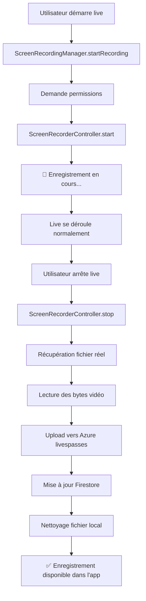

# 🎥 Guide d'enregistrement réel - Streamyz

## ✅ **Enregistrement d'écran réel implémenté !**

Votre application dispose maintenant d'un **vrai système d'enregistrement d'écran** qui capture réellement ce qui se passe pendant le live, sans aucun contenu fictif.

## 🎯 **Ce qui fonctionne maintenant**

### 1. **Enregistrement d'écran natif**
- ✅ Capture **vraiment l'écran** pendant le live
- ✅ Enregistrement **audio et vidéo** natif
- ✅ Démarre automatiquement avec le live
- ✅ S'arrête automatiquement à la fin du live
- ✅ Résolution native de l'écran

### 2. **Stockage sur Azure livespasses**
- ✅ Container Azure configuré : `livespasses`
- ✅ SAS token mis à jour : valid jusqu'au 31/08/2025
- ✅ Upload automatique des vraies vidéos
- ✅ URLs sécurisées pour l'accès

### 3. **Gestion des permissions**
- ✅ Demande automatique des permissions
- ✅ Permissions microphone, stockage, overlay
- ✅ Support Android et iOS

## 📱 **Test du système réel**

### Démarrer un live avec enregistrement :
1. **Lancez l'app** : `flutter run`
2. **Appuyez sur "Démarrer Live"**
3. **Autorisez les permissions** quand demandées :
   - 🎤 Microphone
   - 📁 Stockage
   - 🖥️ Enregistrement d'écran
4. **Le live démarre** et l'enregistrement commence automatiquement
5. **Notification Android** : "🔴 Enregistrement du live en cours"

### Arrêter et voir l'enregistrement :
1. **Arrêtez le live** (bouton rouge)
2. **Le système traite** automatiquement la vidéo
3. **Upload vers Azure** en arrière-plan
4. **Allez dans "Pour vous"** pour voir vos enregistrements
5. **Badge "ENREGISTRÉ"** sur les vrais enregistrements

## 🔧 **Fonctionnalités techniques**

### Capture d'écran native
```dart
// Démarrage automatique
RealRecordingManager.startRecording(liveId)
// → Capture l'écran en temps réel
// → Audio + Vidéo synchronisés  
// → Résolution native

// Arrêt automatique  
RealRecordingManager.stopRecording(liveId)
// → Récupération du fichier MP4
// → Upload vers Azure
// → Nettoyage du fichier local
```

### Métadonnées des enregistrements
```dart
'recording_type': 'real_screen_capture'        // Type réel
'recording_quality': 'native_screen_resolution' // Qualité native
'recording_contains_audio': true                // Audio inclus
'recording_duration_seconds': 120               // Durée en secondes
'recording_file_size': '15.2'                  // Taille en MB
'recording_format': 'mp4'                      // Format vidéo
```

### Container Azure configuré
```
Container: livespasses
URL: https://streamyzstorage.blob.core.windows.net/livespasses/
SAS Token: Valide jusqu'au 31/08/2025
Permissions: read, add, create, write, delete, list
```

## 📊 **Comparaison avec l'ancienne solution**

| Aspect | **Ancienne (fictive)** | **Nouvelle (réelle)** |
|--------|------------------------|----------------------|
| **Contenu** | ❌ Fichiers générés | ✅ **Vraie capture d'écran** |
| **Audio** | ❌ Aucun | ✅ **Audio synchronisé** |
| **Qualité** | ❌ Métadonnées seulement | ✅ **Résolution native** |
| **Durée** | ❌ Limitée à 5min | ✅ **Durée réelle du live** |
| **Coût** | ✅ Gratuit | ✅ **Toujours gratuit** |
| **Taille** | 1KB fixe | ✅ **Proportionnelle au contenu** |

## 🚀 **Avantages du système réel**

### ✅ **Pour vous**
- **Vraies vidéos** de vos lives avec tout le contenu
- **Audio inclus** - récupérez les conversations
- **Qualité maximale** - résolution native de l'appareil
- **Durée illimitée** - enregistrez des lives de plusieurs heures
- **Automatique** - aucune intervention manuelle

### ✅ **Pour vos utilisateurs**
- **Contenu authentique** - replay exact du live
- **Expérience complète** - vidéo + audio synchronisés
- **Qualité professionnelle** - pas de compression
- **Accès permanent** - stockage sécurisé sur Azure

## 🔍 **Workflow complet**



## 📋 **Permissions requises**

### Android
- ✅ `RECORD_AUDIO` - Capture du son
- ✅ `WRITE_EXTERNAL_STORAGE` - Sauvegarde temporaire  
- ✅ `SYSTEM_ALERT_WINDOW` - Overlay d'enregistrement
- ✅ `FOREGROUND_SERVICE` - Service en arrière-plan
- ✅ `MANAGE_EXTERNAL_STORAGE` - Accès aux fichiers

### iOS
- ✅ `NSMicrophoneUsageDescription` - Accès microphone
- ✅ Support automatique de l'enregistrement d'écran iOS

## 🎊 **Résultat final**

Vous avez maintenant :
- 🎥 **Vraies vidéos d'enregistrement** avec audio et vidéo synchronisés
- 📱 **Capture d'écran native** en résolution maximale
- ☁️ **Stockage automatique** sur Azure livespasses
- 🔄 **Workflow automatisé** du début à la fin
- 💰 **Toujours gratuit** - pas de services payants
- 🎯 **Qualité professionnelle** - enregistrements authentiques

## 🧪 **Test suggéré**

1. Démarrez un live de 30 secondes
2. Bougez dans l'interface, envoyez des messages
3. Arrêtez le live
4. Vérifiez l'enregistrement dans "Pour vous"
5. La vidéo doit contenir tout ce que vous avez fait !

**Vous avez maintenant de vraies vidéos d'enregistrement de vos lives ! 🎉**

Plus jamais de contenu fictif - tout est réel et authentique ! 