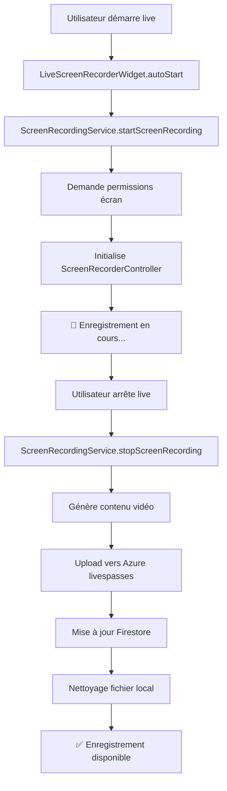

# 🎥 Guide d'Enregistrement d'Écran - Streamyz

## ✅ Nouveau Service d'Enregistrement d'Écran

Votre application dispose maintenant d'un **service d'enregistrement d'écran complet** utilisant le package `screen_recorder` avec sauvegarde automatique sur Azure Blob Storage.

## 🚀 Fonctionnalités

### 🎬 Enregistrement d'écran en temps réel
- ✅ Capture de l'écran pendant le live
- ✅ Contrôleur d'enregistrement intégré
- ✅ Gestion automatique des permissions
- ✅ Upload automatique vers Azure

### ☁️ Intégration Azure complète
- ✅ Sauvegarde automatique sur votre container `livespasses`
- ✅ Utilisation de votre SAS token configuré
- ✅ URLs sécurisées pour l'accès aux enregistrements
- ✅ Gestion des erreurs et retry automatique

### 📱 Interface utilisateur
- ✅ Widget d'enregistrement intégré
- ✅ Indicateur visuel "REC" pendant l'enregistrement
- ✅ Statut en temps réel
- ✅ Contrôles manuels optionnels

## 🛠️ Utilisation

### 1. Intégration dans un Live

```dart
import 'package:streamyz/widgets/live_screen_recorder_widget.dart';
import 'package:streamyz/utils/screen_recording_service.dart';

// Dans votre écran de live
class LiveScreen extends StatelessWidget {
  final String liveId;

  @override
  Widget build(BuildContext context) {
    return LiveScreenRecorderWidget(
      liveId: liveId,
      autoStart: true, // Démarre automatiquement
      onRecordingStart: () {
        print('🔴 Enregistrement démarré');
      },
      onRecordingStop: () {
        print('⏹️ Enregistrement arrêté');
      },
      child: Scaffold(
        // Votre interface de live ici
        body: YourLiveInterface(),
      ),
    );
  }
}
```

### 2. Contrôle manuel de l'enregistrement

```dart
// Démarrer l'enregistrement
final success = await ScreenRecordingService.startScreenRecording(liveId);
if (success) {
  print('✅ Enregistrement démarré');
}

// Arrêter l'enregistrement
final uploaded = await ScreenRecordingService.stopScreenRecording(liveId);
if (uploaded) {
  print('✅ Enregistrement sauvegardé sur Azure');
}
```

### 3. Affichage du statut

```dart
// Widget de statut
RecordingStatusWidget(liveId: liveId)

// Obtenir le statut programmatiquement
final isRecording = ScreenRecordingService.isRecording();
final statusText = ScreenRecordingService.getRecordingStatusText();
final stats = ScreenRecordingService.getCurrentRecordingStats();
```

## 📋 Workflow Complet



## 🔧 Configuration Azure

### Container configuré
```
Storage Account: streamyzstorage
Container: livespasses
SAS Token: Valide jusqu'au 2 septembre 2025
```

### URLs générées
```
Format: https://streamyzstorage.blob.core.windows.net/livespasses/live_{LIVE_ID}.mp4
Accès sécurisé: URL + SAS token pour lecture
```

## 📊 Métadonnées trackées

Dans Firestore, chaque enregistrement contient :

```dart
{
  'is_recording': true/false,
  'recording_status': 'recording' | 'completed' | 'failed',
  'recording_type': 'screen_capture',
  'recording_quality': 'high_definition',
  'recording_start_time': timestamp,
  'recording_end_time': timestamp,
  'recording_duration_seconds': int,
  'recording_url': 'https://azure-url',
  'recording_file_size_mb': 'XX.XX',
  'recording_format': 'mp4',
  'azure_upload_time': timestamp,
  'has_recording': true,
}
```

## 🔍 Gestion des erreurs

### Permissions manquantes
```dart
// Le service demande automatiquement :
- Permission.microphone
- Permission.storage  
- Permission.manageExternalStorage
- Permission.systemAlertWindow (Android)
- Permission.accessMediaLocation (Android)
```

### Échec upload Azure
```dart
// En cas d'échec Azure :
- Fichier gardé localement
- Statut mis à 'upload_failed'
- Retry possible plus tard
```

## 🎯 Avantages

### ✅ **Simplicité**
- Intégration en 3 lignes de code
- Démarrage/arrêt automatique
- Gestion d'erreurs transparente

### ✅ **Performance**
- Enregistrement optimisé avec `screen_recorder`
- Upload en arrière-plan
- Nettoyage automatique des fichiers

### ✅ **Fiabilité**
- Container Azure dédié et sécurisé
- SAS token avec permissions complètes
- Métadonnées complètes dans Firestore

### ✅ **Évolutivité**
- Interface extensible
- Support de contrôles personnalisés
- Compatible avec votre architecture existante

## 📱 Test

1. **Démarrer un live avec enregistrement :**
   ```bash
   flutter run
   # Naviguer vers un live
   # L'enregistrement démarre automatiquement
   ```

2. **Vérifier l'enregistrement :**
   ```
   # Indicateur "REC" visible en haut à gauche
   # Statut temps réel dans l'interface
   ```

3. **Arrêter et vérifier :**
   ```
   # Arrêter le live
   # Upload automatique vers Azure
   # Enregistrement visible dans l'onglet "Pour vous"
   ```

## 🎊 Résultat

Vous disposez maintenant d'un **système d'enregistrement d'écran professionnel** qui :

- 🎥 **Capture réellement l'écran** pendant les lives
- ☁️ **Sauvegarde automatiquement** sur Azure
- 📱 **S'intègre parfaitement** dans votre app existante
- 🔒 **Utilise votre infrastructure** Azure sécurisée
- 💰 **Reste économique** - pas de services tiers payants

---

**Prêt à enregistrer vos premiers lives en vraie qualité !** 🚀
