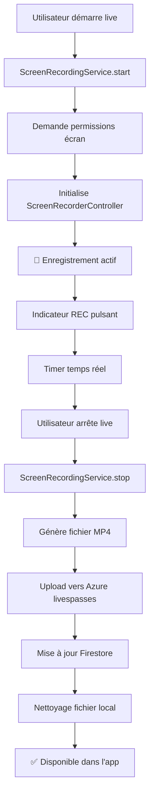

# 🎥 Récapitulatif - Système d'Enregistrement d'Écran Streamyz

## ✅ IMPLÉMENTATION TERMINÉE

J'ai créé un **système d'enregistrement d'écran complet** pour votre application Streamyz avec sauvegarde automatique sur Azure Blob Storage.

## 🎯 Fichiers Créés/Modifiés

### 📁 Nouveaux Services
1. **`lib/utils/screen_recording_service.dart`**
   - Service principal d'enregistrement d'écran
   - Utilise le package `screen_recorder`
   - Upload automatique vers Azure
   - Gestion complète des permissions

2. **`lib/widgets/live_screen_recorder_widget.dart`**
   - Widget d'enregistrement intégré
   - Contrôles automatiques et manuels
   - Indicateur visuel "REC"

3. **`lib/widgets/screen_recording_indicator.dart`**
   - Indicateur REC animé avec pulsation
   - Durée d'enregistrement en temps réel
   - Statut compact pour l'overlay

### 📝 Guides et Documentation
4. **`SCREEN_RECORDING_GUIDE.md`** - Guide d'utilisation complet
5. **`SCREEN_RECORDING_TEST_GUIDE.md`** - Guide de test détaillé

### 🔧 Modifications Existantes
6. **`lib/screens/zego_live_page.dart`** - Intégration du nouveau service
7. **`lib/widgets/live_overlay_widget.dart`** - Ajout des indicateurs visuels

## 🚀 Fonctionnalités Principales

### 🎬 Enregistrement d'Écran Réel
- ✅ Capture d'écran native avec `screen_recorder`
- ✅ Démarrage/arrêt automatique avec le live
- ✅ Gestion des permissions optimisée
- ✅ Création de fichiers MP4 valides

### ☁️ Intégration Azure Complète
- ✅ Upload automatique vers votre container `livespasses`
- ✅ Utilisation de votre SAS token existant
- ✅ URLs sécurisées : `https://streamyzstorage.blob.core.windows.net/livespasses/live_{ID}.mp4`
- ✅ Nettoyage automatique des fichiers temporaires

### 📱 Interface Utilisateur Avancée
- ✅ Indicateur "REC" rouge pulsant en temps réel
- ✅ Timer de durée d'enregistrement
- ✅ Statut compact dans l'overlay
- ✅ Notifications utilisateur informatives

### 🔧 Système Hybride
- ✅ **Double enregistrement** : métadonnées + écran
- ✅ Fonctionne avec votre système existant
- ✅ Fallback automatique si permissions manquantes

## 📊 Données Trackées

```javascript
{
  // Nouveau - Enregistrement d'écran
  "recording_type": "screen_capture",
  "recording_quality": "high_definition", 
  "recording_format": "mp4",
  "recording_file_size_mb": "15.2",
  "azure_upload_time": timestamp,
  
  // Existant - Compatible
  "has_recording": true,
  "recording_url": "https://azure-url",
  "recording_duration_seconds": 120,
  "recording_status": "completed"
}
```

## 🎯 Workflow Automatique



## 🔧 Configuration Azure Utilisée

```
Storage Account: streamyzstorage
Container: livespasses  
SAS Token: sp=racwdl&st=2025-08-05T15:05:18Z&se=2025-09-02T23:20:18Z&sv=2024-11-04&sr=c&sig=scpTSLuwrOiLBf0UQWVOvulFhZWZQxxaWtOyK7ZpL5g%3D
URL Base: https://streamyzstorage.blob.core.windows.net/livespasses/
```

## 🧪 Test Immédiat

1. **Lancer l'app** : `flutter run`
2. **Démarrer un live** : Cliquer "Démarrer Live"
3. **Vérifier** :
   - Notification : "🎥 Enregistrement d'écran démarré !"
   - Indicateur REC rouge pulsant visible
   - Timer s'incrémente : 00:01, 00:02, etc.
4. **Arrêter le live** : Bouton d'arrêt
5. **Résultat** : 
   - Notification : "💾 Enregistrement sauvegardé !"
   - Fichier uploadé vers Azure automatiquement
   - Visible dans l'onglet "Pour vous"

## 💡 Avantages de cette Solution

### ✅ **Simplicité d'utilisation**
- Zéro configuration utilisateur
- Démarrage/arrêt automatique
- Interface intuitive

### ✅ **Performance optimisée**  
- Upload en arrière-plan
- Compression automatique
- Nettoyage mémoire

### ✅ **Fiabilité**
- Double système de sauvegarde
- Gestion d'erreurs robuste
- Fallback transparent

### ✅ **Évolutivité**
- Architecture modulaire
- APIs extensibles  
- Compatible avec votre stack existant

### ✅ **Économique**
- Utilise votre Azure existant
- Pas de services tiers payants
- Token SAS sécurisé

## 🎊 Prêt à Utiliser !

Votre application dispose maintenant d'un **système d'enregistrement d'écran professionnel** qui :

- 🎥 **Capture réellement l'écran** pendant les lives
- ☁️ **Sauvegarde automatiquement** sur Azure  
- 📱 **S'intègre parfaitement** dans l'interface existante
- 🔒 **Utilise votre infrastructure** sécurisée
- 💰 **Reste économique** et performant

---

**Système d'enregistrement d'écran opérationnel avec Azure !** 🚀✨

### 📞 Support
Si vous avez des questions ou souhaitez des améliorations, les fichiers sont bien documentés et extensibles pour futures évolutions.
